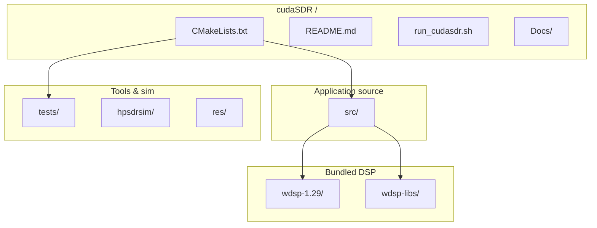
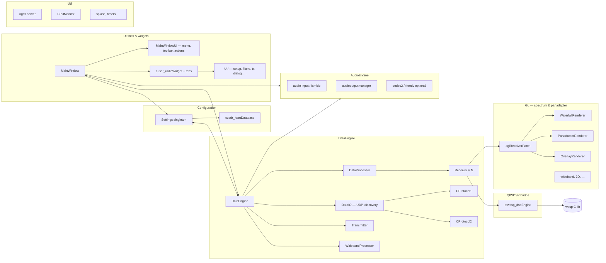
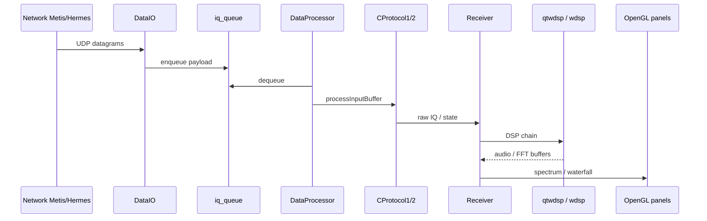

# cudaSDR codebase architecture

High-level views of the repository layout and runtime structure. Diagrams use [Mermaid](https://mermaid.js.org/) (render in GitHub, VS Code, or Cursor preview).

---

## 1. Repository layout (physical)

---

## 2. `src/` module map (logical)

---

## 3. IQ / control data path (simplified)

---

## 4. Key directories (quick reference)

| Path | Role |
|------|------|
| `src/main.cpp` | `QApplication`, logging, `MainWindow` |
| `src/cusdr_settings.*` | Global settings, persistence, signals |
| `src/Settings/` | Modularized configuration (Network, Hardware, etc.) |
| `src/DataEngine/` | Radio I/O, protocols, receivers, TX |
| `src/QtWDSP/` | C++ bridge to WDSP demod/modem chain |
| `src/AudioEngine/` | Sound devices, CW keyer, FreeDV/Codec2 |
| `src/GL/` | OpenGL UI with specialized sub-renderers |
| `src/UI/MainWindow/` | MainWindow UI decomposition (`MainWindowUI`) |
| `src/UI/` | Smaller dialogs and embedded widgets |
| `src/Util/` | Rig control, splash, CPU monitor, timers |
| `wdsp-1.29/` | Upstream-style WDSP sources |
| `wdsp-libs/` | Prebuilt / vendored libs (e.g. rnnoise, specbleach) |
| `tests/` | CMake `BUILD_TESTING` unit tests |
| `hpsdrsim/` | Simulator companion project |
| `Docs/` | Project notes, protocol write-ups |

---

*Generated for navigation and onboarding; refine subgraphs as subsystems move or split.*
