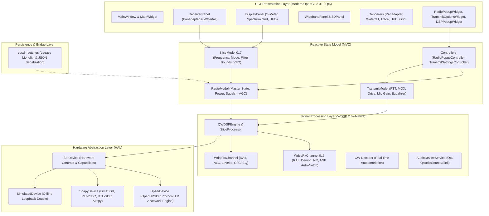

# cudaSDR Comprehensive Codebase Evaluation Report (2026)

**Repository**: `zl2brg/cudaSDR`  
**Branch**: `feature/sdr-device-hal`  
**Date**: September 2026  
**Status**: Authoritative Reference Document  

---

## 1. Executive Summary

`cudaSDR` is a high-performance Software Defined Radio (SDR) application built with **C++17**, **Qt6**, and **Modern OpenGL Core Profile (3.3+)**, integrated with Frank Brickle's **WDSP 2.00** signal processing library. It provides high-fidelity panadapters, waterfalls, CW decoding, TCI / RigCtl remote interfaces, and multi-slice reception across OpenHPSDR (Protocol 1 and Protocol 2) and generic SDR hardware (via SoapySDR).

Over recent development milestones, the codebase has undergone significant structural transformations:
1. **Phase 2 (State Consolidation)**: Transitioned from an ad-hoc, signal-spaghetti state model to a clean Model-View-Controller (MVC) reactive state layer ([`RadioModel`](file:///home/sae/Projects/Personal/cudaSDR/src/Models/RadioModel.h), [`SliceModel`](file:///home/sae/Projects/Personal/cudaSDR/src/Models/SliceModel.h), and [`TransmitModel`](file:///home/sae/Projects/Personal/cudaSDR/src/Models/TransmitModel.h)).
2. **Phase 3A (WDSP 2.0 RAII Encapsulation)**: Replaced unmanaged global C state with thread-safe, RAII-governed DSP channels ([`WdspRxChannel`](file:///home/sae/Projects/Personal/cudaSDR/src/QtWDSP/WdspRxChannel.h) and [`WdspTxChannel`](file:///home/sae/Projects/Personal/cudaSDR/src/QtWDSP/WdspTxChannel.h)), protecting FFTW wisdom generation with mutexes and validating filter bounds.
3. **Phase 3B (Hardware Abstraction Layer)**: Introduced [`ISdrDevice`](file:///home/sae/Projects/Personal/cudaSDR/src/DataEngine/ISdrDevice.h) with concrete drivers ([`HpsdrDevice`](file:///home/sae/Projects/Personal/cudaSDR/src/DataEngine/Drivers/HpsdrDevice.h), [`SoapyDevice`](file:///home/sae/Projects/Personal/cudaSDR/src/DataEngine/Drivers/SoapyDevice.h), and [`SimulatedDevice`](file:///home/sae/Projects/Personal/cudaSDR/src/DataEngine/Drivers/SimulatedDevice.h)), decoupling network protocols and hardware drivers from presentation logic.
4. **Protocol 1 TX Audio & Discovery Stability**: Decimated Protocol 1 hardware mic samples into WDSP, synchronized hardware PTT transitions via edge detection, dynamic Qt6 audio device discovery, and eliminated discovery echo regressions.
5. **Quality Assurance**: Established 20 comprehensive CTest suites passing 100% (~6,370 lines of automated tests).

This report evaluates the current codebase state, catalogs remaining architectural debt, and defines a prioritized, four-track improvement roadmap.

---

## 2. High-Level Architecture Overview



---

## 3. Quantitative Codebase Anatomy

The codebase consists of **~95,400 lines of active C++ and C code** in `src/`, accompanied by **~6,370 lines of automated unit and integration tests** in `tests/`.

| Subsystem Directory | Primary Purpose | LOC | Key Files / Responsibilities |
| :--- | :--- | :---: | :--- |
| **`src/Models/`** & **`src/UI/`** | Reactive MVC State & Controllers | ~4,200 | [`RadioModel`](file:///home/sae/Projects/Personal/cudaSDR/src/Models/RadioModel.h), [`SliceModel`](file:///home/sae/Projects/Personal/cudaSDR/src/Models/SliceModel.h), [`TransmitModel`](file:///home/sae/Projects/Personal/cudaSDR/src/Models/TransmitModel.h), [`eq_curve_plot`](file:///home/sae/Projects/Personal/cudaSDR/src/UI/eq_curve_plot.cpp) |
| **`src/DataEngine/`** | Network Protocols, IO & HAL | ~14,500 | [`ISdrDevice`](file:///home/sae/Projects/Personal/cudaSDR/src/DataEngine/ISdrDevice.h), [`HpsdrDevice`](file:///home/sae/Projects/Personal/cudaSDR/src/DataEngine/Drivers/HpsdrDevice.h), [`SoapyDevice`](file:///home/sae/Projects/Personal/cudaSDR/src/DataEngine/Drivers/SoapyDevice.h), [`cusdr_dataEngine.cpp`](file:///home/sae/Projects/Personal/cudaSDR/src/DataEngine/cusdr_dataEngine.cpp), [`cusdr_dataIO.cpp`](file:///home/sae/Projects/Personal/cudaSDR/src/DataEngine/cusdr_dataIO.cpp), [`cusdr_sliceProcessor.cpp`](file:///home/sae/Projects/Personal/cudaSDR/src/DataEngine/cusdr_sliceProcessor.cpp) |
| **`src/GL/`** | OpenGL 3.3+ Visual Panels & Shaders | ~14,200 | [`cusdr_oglReceiverPanel.cpp`](file:///home/sae/Projects/Personal/cudaSDR/src/GL/cusdr_oglReceiverPanel.cpp), [`cusdr_oglDisplayPanel.cpp`](file:///home/sae/Projects/Personal/cudaSDR/src/GL/cusdr_oglDisplayPanel.cpp), [`PanadapterRenderer.cpp`](file:///home/sae/Projects/Personal/cudaSDR/src/GL/PanadapterRenderer.cpp), [`WaterfallRenderer.cpp`](file:///home/sae/Projects/Personal/cudaSDR/src/GL/WaterfallRenderer.cpp), [`HudRenderer.cpp`](file:///home/sae/Projects/Personal/cudaSDR/src/GL/HudRenderer.cpp) |
| **`src/QtWDSP/`** & **`wdsp-2.00/`** | Signal Processing & Demodulation | ~18,000 | [`WdspRxChannel.cpp`](file:///home/sae/Projects/Personal/cudaSDR/src/QtWDSP/WdspRxChannel.cpp), [`WdspTxChannel.cpp`](file:///home/sae/Projects/Personal/cudaSDR/src/QtWDSP/WdspTxChannel.cpp), [`qtwdsp_dspEngine.cpp`](file:///home/sae/Projects/Personal/cudaSDR/src/QtWDSP/qtwdsp_dspEngine.cpp), [`linux_port.c`](file:///home/sae/Projects/Personal/cudaSDR/src/QtWDSP/wdsp-2.00/linux_port.c) |
| **`src/AudioEngine/`** | Audio Routing, CW Sidetone & Devices | ~3,500 | [`AudioDeviceService.cpp`](file:///home/sae/Projects/Personal/cudaSDR/src/AudioEngine/AudioDeviceService.cpp), [`cwramp.cpp`](file:///home/sae/Projects/Personal/cudaSDR/src/AudioEngine/cwramp.cpp) |
| **`src/Util/`** | Network Remotes & Utility Helpers | ~8,200 | [`cusdr_tciserver.cpp`](file:///home/sae/Projects/Personal/cudaSDR/src/Util/cusdr_tciserver.cpp), [`qcircularbuffer.h`](file:///home/sae/Projects/Personal/cudaSDR/src/Util/qcircularbuffer.h), [`cusdr_colorTriangle.cpp`](file:///home/sae/Projects/Personal/cudaSDR/src/Util/cusdr_colorTriangle.cpp) |
| **`src/` Root** | Main Window, Widgets & Settings Monolith | ~22,800 | [`cusdr_settings.cpp`](file:///home/sae/Projects/Personal/cudaSDR/src/cusdr_settings.cpp) (5,976 lines), [`cusdr_radioPopupWidget.cpp`](file:///home/sae/Projects/Personal/cudaSDR/src/cusdr_radioPopupWidget.cpp), [`cusdr_mainWidget.cpp`](file:///home/sae/Projects/Personal/cudaSDR/src/cusdr_mainWidget.cpp) |
| **`tests/`** | Automated CTest Unit & Integration Suites | ~6,370 | 20 test suites covering Models, HAL, Boundaries, Protocols, Config JSON, Audio, and DSP |

---

## 4. In-Depth Subsystem Evaluation

### 4.1 State Management & Architecture
- **Current State**: The introduction of [`RadioModel`](file:///home/sae/Projects/Personal/cudaSDR/src/Models/RadioModel.h), [`SliceModel`](file:///home/sae/Projects/Personal/cudaSDR/src/Models/SliceModel.h), and [`TransmitModel`](file:///home/sae/Projects/Personal/cudaSDR/src/Models/TransmitModel.h) established clean, reactive state containers with deterministic signal emissions on mutation. View controllers interact directly with models.
- **Identified Debt**:
  - [`cusdr_settings.cpp`](file:///home/sae/Projects/Personal/cudaSDR/src/cusdr_settings.cpp) remains a massive god-object (5,976 lines) with `cusdr_settings.h` (1,769 lines).
  - Many methods in `Settings` act merely as pass-through forwarding calls into `RadioModel` or `SliceModel`, keeping legacy tight coupling alive.
  - Serialization to JSON exists alongside legacy QSettings INI serialization, creating potential divergence during configuration save/restore.

### 4.2 SDR Hardware Abstraction Layer (HAL)
- **Current State**: [`ISdrDevice`](file:///home/sae/Projects/Personal/cudaSDR/src/DataEngine/ISdrDevice.h) defines a clean interface for hardware discovery, capabilities reporting (`DeviceCapabilities`), connection lifecycle, and transmitter IQ sample streaming via `sendTxIq()`.
- **Identified Debt**:
  - **Asymmetric RX Data Path**: While TX IQ passes cleanly through `ISdrDevice`, RX IQ is still pumped through legacy buffers in [`cusdr_dataIO.cpp`](file:///home/sae/Projects/Personal/cudaSDR/src/DataEngine/cusdr_dataIO.cpp) and [`SoapySDRDataSource.cpp`](file:///home/sae/Projects/Personal/cudaSDR/src/DataEngine/SoapySDRDataSource.cpp) into [`cusdr_sliceProcessor.cpp`](file:///home/sae/Projects/Personal/cudaSDR/src/DataEngine/cusdr_sliceProcessor.cpp).
  - **Fragmented Discovery**: Device discovery for OpenHPSDR lives inside `DataEngine`/`DataIO`, while SoapySDR hardware discovery lives inside `SoapySDRDataSource`, rather than being unified in a device manager.

### 4.3 Digital Signal Processing (DSP) & WDSP 2.0
- **Current State**: [`WdspRxChannel`](file:///home/sae/Projects/Personal/cudaSDR/src/QtWDSP/WdspRxChannel.h) and [`WdspTxChannel`](file:///home/sae/Projects/Personal/cudaSDR/src/QtWDSP/WdspTxChannel.h) encapsulate WDSP channel indices safely. Filter edge bounds are strictly clamped, FFTW wisdom generation is protected with mutexes, and transmit audio processing (ALC, CFC, NURBS graphic EQ) is modern and clean.
- **Identified Debt**:
  - **Worker Threading Overhead**: In [`wdsp-2.00/linux_port.c`](file:///home/sae/Projects/Personal/cudaSDR/src/QtWDSP/wdsp-2.00/linux_port.c), worker threads are created and joined on the fly with `pthread_create()` / `pthread_join()` for background FFT tasks. Under high slice counts or high FFT display rates, this causes excessive OS context-switch overhead.
  - **PureSignal 3.0 / APD**: WDSP 2.0 contains advanced Adaptive Pre-Distortion (PureSignal), but the loopback feedback path from the hardware transmitter is not yet connected to `WdspTxChannel`.

### 4.4 OpenGL Visualization & Panadapter
- **Current State**: Rendering pipeline uses Modern OpenGL 3.3 Core Profile with vertex/fragment shaders and streaming Pixel Buffer Objects (PBO) for waterfalls. [`PanadapterRenderer`](file:///home/sae/Projects/Personal/cudaSDR/src/GL/PanadapterRenderer.cpp), [`WaterfallRenderer`](file:///home/sae/Projects/Personal/cudaSDR/src/GL/WaterfallRenderer.cpp), and [`HudRenderer`](file:///home/sae/Projects/Personal/cudaSDR/src/GL/HudRenderer.cpp) provide modular GPU drawing.
- **Identified Debt**:
  - **Input Event Coupling in GL Panels**: [`cusdr_oglReceiverPanel.cpp`](file:///home/sae/Projects/Personal/cudaSDR/src/GL/cusdr_oglReceiverPanel.cpp) (2,845 lines) and [`cusdr_oglDisplayPanel.cpp`](file:///home/sae/Projects/Personal/cudaSDR/src/GL/cusdr_oglDisplayPanel.cpp) (2,738 lines) combine OpenGL drawing setup with thousands of lines of mouse dragging, wheel zooming, filter edge resizing, crosshair tracking, and context menu spawning.

### 4.5 Audio Engine & Routing
- **Current State**: [`AudioDeviceService`](file:///home/sae/Projects/Personal/cudaSDR/src/AudioEngine/AudioDeviceService.cpp) queries Qt6 audio devices dynamically. Hardware microphone input from Protocol 1 (48 kHz) is properly decimated to 8 kHz for WDSP, and hardware PTT state transitions are tracked with edge detection.
- **Identified Debt**:
  - Audio buffers use multiple separate FIFO implementations (`m_faudioInQueue`, `au_queue`, `m_hpsdrMicBuffer`) with basic mutex locks, which can cause micro-stuttering under high CPU load. A lock-free SPSC (Single Producer Single Consumer) ring buffer is needed.

### 4.6 Automated Testing & CI
- **Current State**: 20 test suites (~6,370 lines) run via CTest, verifying TCI WebSocket commands, HPSDR packet parsing, device identity, WDSP channel life cycle, and settings serialization.
- **Identified Debt**:
  - Tests focus on non-GUI components. There are no headless offscreen OpenGL tests (using `QOffscreenSurface`) to verify shader compilation and PBO buffer uploads in automated CI.

---

## 5. Technical Debt & Risk Matrix

| Risk / Debt Item | Impact | Complexity | Urgency | Proposed Remediation |
| :--- | :---: | :---: | :---: | :--- |
| **Settings God Object** (5,976 lines) | High | Medium | Medium | Strip duplicate getters; delegate to `RadioModel`/`SliceModel`; keep purely for JSON serialization. |
| **Input/Render Coupling in Panels** | Medium | Medium | High | Extract mouse, keyboard, and gesture logic into `PanadapterInputController`. |
| **Transient DSP Thread Creation** (`linux_port.c`) | High | Low | High | Replace on-the-fly `pthread_create` calls with a persistent 4-thread worker pool. |
| **Asymmetric HAL RX Data Path** | High | High | High | Route incoming RX IQ streams through `ISdrDevice` callbacks or standard queues. |
| **Lock-based Audio Buffers** | Medium | Low | Medium | Migrate audio and TCI streams to lock-free SPSC ring buffers. |
| **PureSignal APD Unwired** | Medium | Medium | Low | Wire TX IQ feedback samples to `WdspTxChannel` for adaptive predistortion. |

---

## 6. Strategic Roadmap & Recommendations

```mermaid
timeline
    title cudaSDR Strategic Modernization Roadmap
    section Track 1 : UI & Interaction
      PanadapterInputController : Extract mouse/wheel/gesture event handling from GL panels
      Render Pass Modularization : Separate Grid, Trace, Filter, and Marker HUD passes
    section Track 2 : Hardware HAL
      Full RX Ingest Pipeline : Route RX IQ through ISdrDevice interface
      Unified Device Discovery : Centralize HPSDR and Soapy discovery into SdrDeviceManager
    section Track 3 : DSP & Audio
      Persistent Worker Thread Pool : Eliminate transient pthreads in linux_port.c
      Lock-Free SPSC Audio Buffers : Low-latency audio and TCI sample streaming
      PureSignal APD Integration : Transmit linearization in WdspTxChannel
    section Track 4 : State & Persistence
      Strip Settings Monolith : Remove 200+ forwarder getters; pure JSON DTO
```

### Track 1: UI & Interaction Layer Modernization
1. **Extract `PanadapterInputController`**:
   - Move mouse press, move, release, wheel zoom, and drag-and-drop math out of [`cusdr_oglReceiverPanel.cpp`](file:///home/sae/Projects/Personal/cudaSDR/src/GL/cusdr_oglReceiverPanel.cpp) into a dedicated event controller.
   - The input controller updates [`SliceModel`](file:///home/sae/Projects/Personal/cudaSDR/src/Models/SliceModel.h) directly; the OpenGL panel simply paints the current model state.
2. **Modularize Panel Render Passes**:
   - Break [`cusdr_oglDisplayPanel.cpp`](file:///home/sae/Projects/Personal/cudaSDR/src/GL/cusdr_oglDisplayPanel.cpp) into discrete render passes: `SpectrumGridPass`, `TracePass`, `FilterBandwidthPass`, `MarkerHudPass`.

### Track 2: Hardware HAL Ingest & Unified Discovery
1. **Unify RX IQ Stream in `ISdrDevice`**:
   - Add `readRxIq(int rx, float* buffer, int count)` or `registerRxCallback()` to [`ISdrDevice`](file:///home/sae/Projects/Personal/cudaSDR/src/DataEngine/ISdrDevice.h).
   - Route both OpenHPSDR packets and SoapySDR streams through this standard abstraction, completely decoupling [`cusdr_sliceProcessor.cpp`](file:///home/sae/Projects/Personal/cudaSDR/src/DataEngine/cusdr_sliceProcessor.cpp) from protocol transport details.
2. **Centralize Hardware Discovery**:
   - Merge UDP network broadcast discovery and Soapy device enumeration into an `SdrDeviceManager` service.

### Track 3: High-Performance DSP & Audio Pipelines
1. **Persistent Worker Thread Pool in `linux_port.c`**:
   - Replace on-demand `pthread_create()` / `pthread_join()` in [`linux_port.c`](file:///home/sae/Projects/Personal/cudaSDR/src/QtWDSP/wdsp-2.00/linux_port.c) with a static pool of pre-warmed worker threads waiting on condition variables.
2. **Lock-Free SPSC Audio Ring Buffers**:
   - Replace mutexed `QQueue` audio buffers with single-producer single-consumer ring buffers for local audio output and TCI client streaming.
3. **PureSignal 3.0 Linearization**:
   - Connect receiver feedback samples during transmit to [`WdspTxChannel`](file:///home/sae/Projects/Personal/cudaSDR/src/QtWDSP/WdspTxChannel.h) to enable automatic transmitter IMD correction.

### Track 4: Settings Monolith Demotion
1. **Strip Legacy Forwarder Getters**:
   - Audit [`cusdr_settings.cpp`](file:///home/sae/Projects/Personal/cudaSDR/src/cusdr_settings.cpp) and remove getters and setters that duplicate [`RadioModel`](file:///home/sae/Projects/Personal/cudaSDR/src/Models/RadioModel.h) and [`SliceModel`](file:///home/sae/Projects/Personal/cudaSDR/src/Models/SliceModel.h).
2. **Consolidate Persistence**:
   - Make `Settings` purely a configuration data transfer object (DTO) that serializes and deserializes application settings directly to/from JSON.

---

## 7. Recommended Immediate Next Step

**Recommended Focus**: **Track 3 (Task 1: Persistent Worker Pool in `linux_port.c`)** or **Track 1 (Task 1: `PanadapterInputController`)**.
- Implementing the **Persistent Worker Pool** in [`linux_port.c`](file:///home/sae/Projects/Personal/cudaSDR/src/QtWDSP/wdsp-2.00/linux_port.c) provides an immediate performance boost to the DSP pipeline and eliminates OS thread creation jitter with low risk and fast turnaround.
- Alternatively, extracting **`PanadapterInputController`** removes the largest cluster of technical debt in the UI layer.
