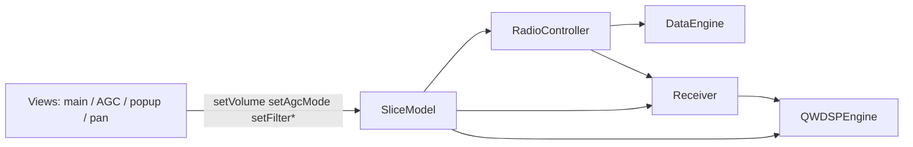

# MVC slice binding

`SliceModel` is the runtime source of truth per receiver. `RadioController` and direct slice connections wire DSP/hardware; `Settings` persists to INI via `m_receiverDataList`.

## Data flow

## Bound through `RadioController`

Per slice (`id` == receiver index), after `DataEngine::initReceivers()`:

| Signal | Target |
|--------|--------|
| `frequencyChanged` | `DataEngine::setFrequency` |
| `centerFrequencyChanged` | `Receiver::setCtrFrequency` + `io.rx_freq_change` |
| `dspModeChanged` | `applySliceDspMode` + `Receiver::applyDspModeFromSlice` |
| `filterChanged` | `Receiver::applyFilterFromSlice` |

## Bound directly on `SliceModel` (at RX init)

| Signal | Target |
|--------|--------|
| `volumeChanged` / `muteChanged` | `Receiver::setAudioVolume` |
| `volumeChanged` / `muteChanged` | `QWDSPEngine::setVolume` |
| `agcModeChanged` | `QWDSPEngine::setAGCMode` |
| `agcGainChanged` | `QWDSPEngine::setAGCThreshold` |
| `agcMaxGainChanged` | `QWDSPEngine::setAGCMaximumGain` |
| `agcFixedGainChanged` | `SetRXAAGCFixed` |
| `agcHangThresholdChanged` / `agcSlopeChanged` | WDSP AGC params |
| `dspModeChanged` / `filterChanged` | WDSP mode & filters |
| S-meter | `Receiver` → `RadioTelemetry::setSMeterValue` → `SliceModel` → `OGLDisplayPanel` |
| Spectrum / link status | `Receiver` / protocols → `RadioTelemetry` → GL panels |
| NB/NR/ANF/SNB, FFT, pan/wf modes, avg, grid | `SliceModel` → WDSP / GL (no Settings relay) |
| Protocol stream sync | `DataIO` sequence check → `RadioTelemetry::setProtocolSync` |

## Settings entry points

| User action | Updates |
|-------------|---------|
| Volume slider | `SliceModel::setVolume` (or `Settings::setMainVolume` → slice) |
| Mute | `SliceModel::setMute` |
| AGC mode / gain / hang | `Settings::setAGC*` → `SliceModel` when `RadioModel` present |

Legacy `Settings::*Changed` signals for volume/AGC/mode/filter are **not** relayed from `syncSlicesWithSettings`; views listen to `SliceModel` instead.

## Persistence

- **Load:** `Settings::syncSlicesWithSettings()` — INI → `SliceModel`
- **Save:** `Settings::syncSettingsWithSlices()` — `SliceModel` → `m_receiverDataList` → INI

## Files

- `src/Controllers/RadioController.{h,cpp}`
- `src/DataEngine/cusdr_receiver.cpp` — `applyDspModeFromSlice`, `applyFilterFromSlice`, volume from slice
- `src/QtWDSP/qtwdsp_dspEngine.cpp` — slice-first WDSP connects
- `src/Models/RadioTelemetry.{h,cpp}` — live spectrum, meters, sync/PA telemetry
- `src/cusdr_settings.cpp` — persistence / config only (no telemetry relays)
- `src/cusdr_mainWidget.cpp`, `src/cusdr_agcWidget.cpp` — slice UI feedback
