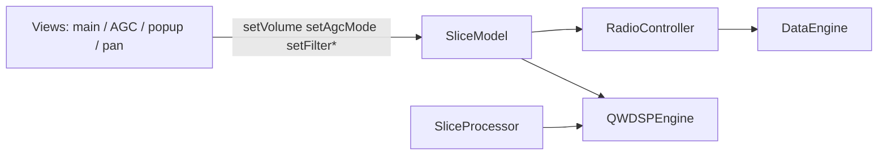

# MVC slice binding

`SliceModel` is the runtime source of truth per receiver. `RadioController` and direct slice connections wire DSP/hardware; `Settings` persists to INI via `m_receiverDataList`.

## Data flow

## Bound through `RadioController` (protocol / TX only)

Per slice (`id` == receiver index), after `DataEngine::initReceivers()`:

| Signal | Target |
|--------|--------|
| `centerFrequencyChanged` | `io.rx_freq_change` (Protocol 1/2 center-freq CC) |
| `dspModeChanged` | `DataEngine::applySliceDspMode` (TX CC bytes) |

VFO (`frequencyChanged`), filters, volume, and WDSP mode are **not** routed through `SliceProcessor`; they go `SliceModel` → `QWDSPEngine` at RX init.

Legacy center-frequency updates from `Settings::setCtrFrequency` still emit `ctrFrequencyChanged` → `DataEngine::setFrequency` via `connectDSPSlots()`.

## Bound directly on `SliceModel` (at RX init)

| Signal | Target |
|--------|--------|
| `volumeChanged` / `muteChanged` | `QWDSPEngine::setVolume` |
| `agcModeChanged` | `QWDSPEngine::setAGCMode` |
| `agcGainChanged` | `QWDSPEngine::setAGCThreshold` |
| `agcMaxGainChanged` | `QWDSPEngine::setAGCMaximumGain` |
| `agcFixedGainChanged` | `SetRXAAGCFixed` |
| `agcHangThresholdChanged` / `agcSlopeChanged` | WDSP AGC params |
| `dspModeChanged` / `filterChanged` | WDSP mode & filters |
| S-meter | `SliceProcessor` → `RadioTelemetry::setSMeterValue` → `SliceModel` → `OGLDisplayPanel` |
| Spectrum / link status | `SliceProcessor` / protocols → `RadioTelemetry` → GL panels |
| NB/NR/ANF/SNB, FFT, pan/wf modes, avg, grid | `SliceModel` → WDSP / GL (no Settings relay) |
| Protocol stream sync | `DataIO` sequence check → `RadioTelemetry::setProtocolSync` |

## Settings entry points & Single-Authority Architecture (Phase 2)

| User action | Authority | Updates |
|-------------|-----------|---------|
| Filter frequencies / slope | `SliceModel` | `SliceModel::setFilterLow/High/Slope` (UI mutates slice directly; `Settings` forwards `filterFrequenciesChanged` to `Transmitter`) |
| Mode (DSP / WDSP) | `SliceModel` | `SliceModel::setDspMode` (or `Settings::setDSPMode` → slice); `Settings` forwards `dspModeChanged` |
| Volume / Mute | `SliceModel` | `SliceModel::setVolume` / `setMute` |
| AGC mode / gain / slope / hang | `SliceModel` | `SliceModel::setAgc*` (UI mutates slice directly; `Settings::setAGC*` delegates to slice when model present) |
| Display / averaging / pan / wf | `SliceModel` | `SliceModel::set*` (UI mutates slice directly) |
| CW decode | `SliceModel` | `SliceModel::setCwDecodeEnabled` |

### Signal flow & loop elimination
- **Direct UI mutation:** Controllers (`RadioPopupController`, `DisplaySettingsController`) mutate `SliceModel` directly as the primary authority. Redundant calls to `Settings` have been eliminated.
- **Forwarding for legacy components:** `Settings::syncSlicesWithSettings()` connects `SliceModel::filterChanged` and `SliceModel::dspModeChanged` to emit `Settings::filterFrequenciesChanged` and `Settings::dspModeChanged` so non-MVC components (such as `Transmitter` and `TciServer`) receive updates without circular ping-ponging.
- **Slice-aware getters:** All runtime slice getters in `Settings` (`getFilterLo`, `getFilterHi`, `getDSPMode`, `getAGCSlope`, `getAGCHangThreshold`, `getAGCHangLeveldB`, `getAGCMaximumGain_dB`, `getAGCFixedGain_dB`, `getMainVolume`, `getCwDecode`, etc.) defer to `sliceModel(rx)` when active.

## Persistence

- **Load (Boot only):** `Settings::syncSlicesWithSettings()` — INI/JSON → `SliceModel`
- **Save (Shutdown only):** `Settings::syncSettingsWithSlices()` — `SliceModel` → `m_receiverDataList` → INI/JSON

## Phase 3: SliceProcessor without `TReceiver` mirror

`SliceProcessor` (formerly `Receiver`) is a DSP-thread worker only (IQ queue, spectrum, audio). It no longer holds a copy of `TReceiver m_receiverData` or mirrors Settings signals into local state.

| Concern | Source |
|---------|--------|
| Frequency, mode, filters, volume, AGC | `SliceModel` (runtime) |
| Ham band, attenuators, DSP core, INI fields | `Settings` getters / persistence |
| Protocol center-freq CC | `RadioController` → `DataEngine::setFrequency` → `io.rx_freq_change` only |
| WDSP init & live updates | `QWDSPEngine` reads `SliceModel` first (`centerFrequencyHz`, `currentDspMode`) |

Removed from `SliceProcessor`: mirror slots (`setHamBand`, `setDspMode`, `setCtrFrequency`, …), redundant getters, and `DataEngine::setFrequency` no longer calls `RX[rx]->setCtrFrequency`.

## Phase 4: UI reads slice + Settings getters

Views no longer copy `TReceiver` lists at init. Runtime fields come from `SliceModel` (when the widget is slice-scoped) or `Settings::sliceModel(rx)` / slice-aware getters (`getFilterLo`, `getDSPMode`, `getPanadapterMode`, …). Persistence-only per-band data (`dspModeList`, last-frequency lists, dBm scale per band) uses new `Settings` accessors.

Removed `QList<TReceiver> m_rxDataList` / `m_receiverDataList` from GL panels, radio/popup widgets, AGC/display/color options, and filter/radio UI helpers. `CProtocol2` still reads `getReceiverDataList()` for encoding (protocol layer, not UI).

## Phase 5: `Receiver` → `SliceProcessor`

The DSP worker class and files were renamed to reflect MVC roles: `SliceModel` owns GUI-thread state; `SliceProcessor` runs IQ → WDSP → spectrum/audio on the DSP thread. `DataEngine::RX` is now `QList<SliceProcessor*>`.

Unchanged (different concepts): `ReceiverWidget`, `ReceiverConfig`, `ReceiverAudioOutput`, `AudioReceiver`, HPSDR “receiver” count/index terminology.

## Files

- `src/Controllers/RadioController.{h,cpp}`
- `src/DataEngine/cusdr_sliceProcessor.{h,cpp}` — per-slice DSP worker (IQ queue, spectrum)
- `src/QtWDSP/qtwdsp_dspEngine.cpp` — slice-first WDSP connects
- `src/Models/RadioTelemetry.{h,cpp}` — live spectrum, meters, sync/PA telemetry
- `src/cusdr_settings.cpp` — persistence / config only (no telemetry relays)
- `src/cusdr_mainWidget.cpp`, `src/cusdr_agcWidget.cpp` — slice UI feedback
