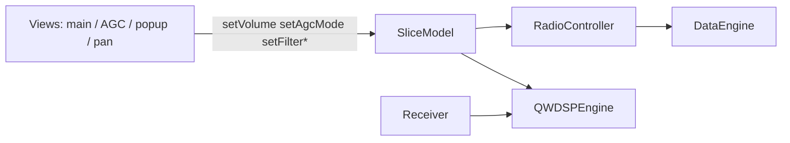

# MVC slice binding

`SliceModel` is the runtime source of truth per receiver. `RadioController` and direct slice connections wire DSP/hardware; `Settings` persists to INI via `m_receiverDataList`.

## Data flow

## Bound through `RadioController` (protocol / TX only)

Per slice (`id` == receiver index), after `DataEngine::initReceivers()`:

| Signal | Target |
|--------|--------|
| `centerFrequencyChanged` | `io.rx_freq_change` (Protocol 1/2 center-freq CC) |
| `dspModeChanged` | `DataEngine::applySliceDspMode` (TX CC bytes) |

VFO (`frequencyChanged`), filters, volume, and WDSP mode are **not** routed through `Receiver`; they go `SliceModel` → `QWDSPEngine` at RX init.

Legacy center-frequency updates from `Settings::setCtrFrequency` still emit `ctrFrequencyChanged` → `DataEngine::setFrequency` via `connectDSPSlots()`.

## Bound directly on `SliceModel` (at RX init)

| Signal | Target |
|--------|--------|
| `volumeChanged` / `muteChanged` | `QWDSPEngine::setVolume` |
| `agcModeChanged` | `QWDSPEngine::setAGCMode` |
| `agcGainChanged` | `QWDSPEngine::setAGCThreshold` |
| `agcMaxGainChanged` | `QWDSPEngine::setAGCMaximumGain` |
| `agcFixedGainChanged` | `SetRXAAGCFixed` |
| `agcHangThresholdChanged` / `agcSlopeChanged` | WDSP AGC params |
| `dspModeChanged` / `filterChanged` | WDSP mode & filters |
| S-meter | `Receiver` → `RadioTelemetry::setSMeterValue` → `SliceModel` → `OGLDisplayPanel` |
| Spectrum / link status | `Receiver` / protocols → `RadioTelemetry` → GL panels |
| NB/NR/ANF/SNB, FFT, pan/wf modes, avg, grid | `SliceModel` → WDSP / GL (no Settings relay) |
| Protocol stream sync | `DataIO` sequence check → `RadioTelemetry::setProtocolSync` |

## Settings entry points

| User action | Updates |
|-------------|---------|
| Volume slider | `SliceModel::setVolume` (or `Settings::setMainVolume` → slice) |
| Mute | `SliceModel::setMute` |
| AGC mode / gain / hang | `Settings::setAGC*` → `SliceModel` when `RadioModel` present |

Legacy `Settings::*Changed` signals for volume/AGC/mode/filter are **not** relayed from `syncSlicesWithSettings`; views listen to `SliceModel` instead.

## Persistence

- **Load:** `Settings::syncSlicesWithSettings()` — INI → `SliceModel`
- **Save:** `Settings::syncSettingsWithSlices()` — `SliceModel` → `m_receiverDataList` → INI

## Phase 3: Receiver without `TReceiver` mirror

`Receiver` is a DSP-thread worker only (IQ queue, spectrum, audio). It no longer holds a copy of `TReceiver m_receiverData` or mirrors Settings signals into local state.

| Concern | Source |
|---------|--------|
| Frequency, mode, filters, volume, AGC | `SliceModel` (runtime) |
| Ham band, attenuators, DSP core, INI fields | `Settings` getters / persistence |
| Protocol center-freq CC | `RadioController` → `DataEngine::setFrequency` → `io.rx_freq_change` only |
| WDSP init & live updates | `QWDSPEngine` reads `SliceModel` first (`centerFrequencyHz`, `currentDspMode`) |

Removed from `Receiver`: mirror slots (`setHamBand`, `setDspMode`, `setCtrFrequency`, …), redundant getters, and `DataEngine::setFrequency` no longer calls `RX[rx]->setCtrFrequency`.

UI widgets still read `Settings::getReceiverDataList()` for some display state; Phase 4 migrates those to `RadioModel::slices()`.

## Files

- `src/Controllers/RadioController.{h,cpp}`
- `src/DataEngine/cusdr_receiver.cpp` — DSP worker (IQ queue, spectrum); no slice→WDSP relay
- `src/QtWDSP/qtwdsp_dspEngine.cpp` — slice-first WDSP connects
- `src/Models/RadioTelemetry.{h,cpp}` — live spectrum, meters, sync/PA telemetry
- `src/cusdr_settings.cpp` — persistence / config only (no telemetry relays)
- `src/cusdr_mainWidget.cpp`, `src/cusdr_agcWidget.cpp` — slice UI feedback
